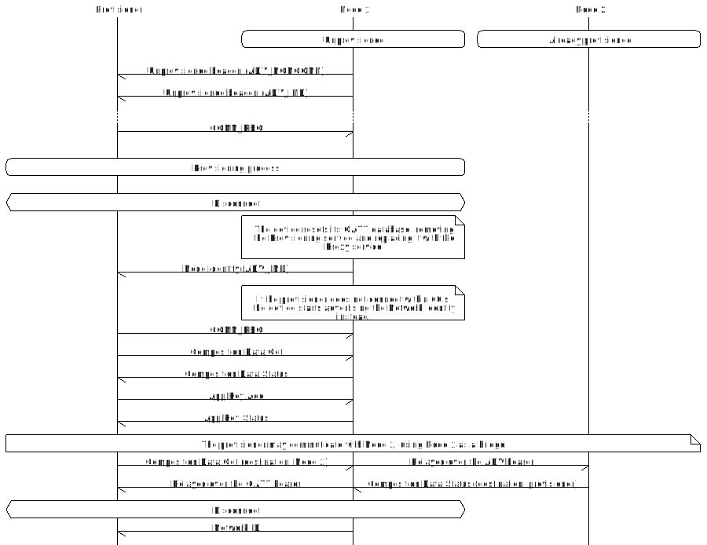

# GATT provisioning and Proxy (experimental)

Provisioning over GATT<sup><a href="#fn:1">1</a></sup> and the Proxy protocol<sup><a
href="#fn:2">2</a></sup> are optional features that allow a device without support for the
advertising bearer to provision and/or communicate with the mesh network through a device using a
GATT interface.

A device does not need to support both the GATT provisioning bearer (PB-GATT) and the Proxy feature,
but in the Light Switch example applications, both are supported by default. The sequence
diagram below shows how a device is provisioned over GATT and then transitions to being a GATT Proxy
server.



The figure shows that the device first advertises both connectable and non-connectable
Unprovisioned Device beacons. The connectable beacon is used for PB-GATT and the non-connectable is
for PB-ADV. The connectable beacon has a slightly different format as it also includes the Mesh
Provisioning Service UUID<sup><a href="#fn:3">3</a></sup>. PB-GATT uses the interface provided in
`mesh_adv.h` for advertising. Immediately after the provisioner has connected to the device, it
stops advertising both beacons. When the provisioning process is complete, the device must reset
its GATT database to comply with the following requirement from the Mesh Profile Specification v1.0:

> A device may support the Mesh Provisioning Service or the Mesh Proxy Service or both. If both are
> supported, only one of these services shall be exposed in the GATT database at a time.<sup><a href="#fn:4">3</a></sup>

The reset is done by the helper module `mesh_provisionee.c`. To reset the database, the SoftDevice
is disabled and re-enabled. This means that any application service or setting needs to be
re-initialized after provisioning. This is done in the `prov_complete_cb()` callback from
`mesh_provisionee.h`. For example, in the Light Switch server example:

```c
static void provisioning_complete_cb(void)
{
    __LOG(LOG_SRC_APP, LOG_LEVEL_INFO, "Successfully provisioned\n");

    /* Restores the application parameters after switching from the Provisioning
     * service to the Proxy  */
    gap_params_init();
    conn_params_init();
    // ...
}
```

GATT support in mesh is provided through the following source files:
- `mesh/gatt/src/mesh_gatt.c`
  - Bearer for the (GATT) Proxy protocol.
  - Required for both PB-GATT and GATT Proxy support.
- `mesh/gatt/src/proxy.c`
  - Implements a `core_tx.h` interface for the GATT bearer.
  - Handles starting and stopping of Proxy advertisements.
  - Required for GATT Proxy support.
- `mesh/gatt/src/proxy_filter.c`
  - Implements the filters used by the Proxy protocol.
  - Required for GATT Proxy support.
- `mesh/prov/src/nrf_mesh_prov_bearer_gatt.c`
  - Implements the generic provisioning bearer interface for GATT.
  - Required for PB-GATT support.
- `examples/common/src/mesh_adv.c`
  - Implements an advertising API for the mesh stack. The implementation is provided as an example
    module to give the user as much control as possible over the SoftDevice's API (for example, to
    add more AD-types into the advertising data or scan response).
  - Required for both PB-GATT and GATT Proxy support.


Furthermore, there are two defines, @ref MESH_FEATURE_PB_GATT_ENABLED and @ref MESH_FEATURE_GATT_PROXY_ENABLED, that control the inclusion
of GATT related code in other sources. For example, the Configuration server
(`models/foundation/src/config_server.c`) behaves diffently when @ref MESH_FEATURE_GATT_PROXY_ENABLED is supported.
@ref MESH_FEATURE_PB_GATT_ENABLED controls inclusion of _all_ GATT related code in
`examples/common/src/mesh_provisionee.c`, whereas @ref MESH_FEATURE_GATT_PROXY_ENABLED controls the GATT Proxy feature
specifically.

---

<sup id="fn:1">1</sup> Mesh Profile Specification v1.0 Section 5.2.2, page 229. <br>
<sup id="fn:2">2</sup> Mesh Profile Specification v1.0 Chapter 6, page 260. <br>
<sup id="fn:3">3</sup> Mesh Profile Specification v1.0 Section 7.1.2.2.1, page 271. <br>
<sup id="fn:4">4</sup> Mesh Profile Specification v1.0 Chapter 7, page 269. <br>

